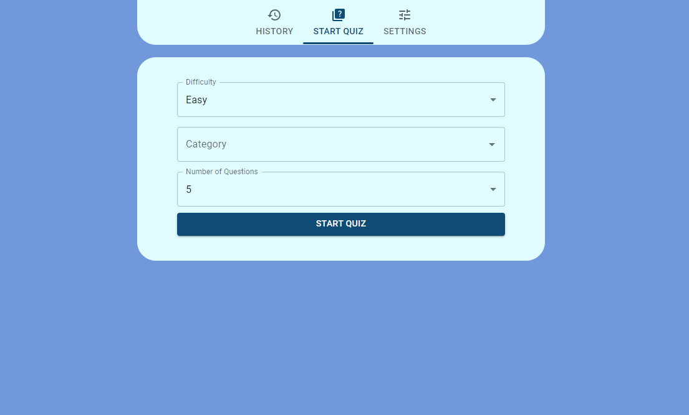
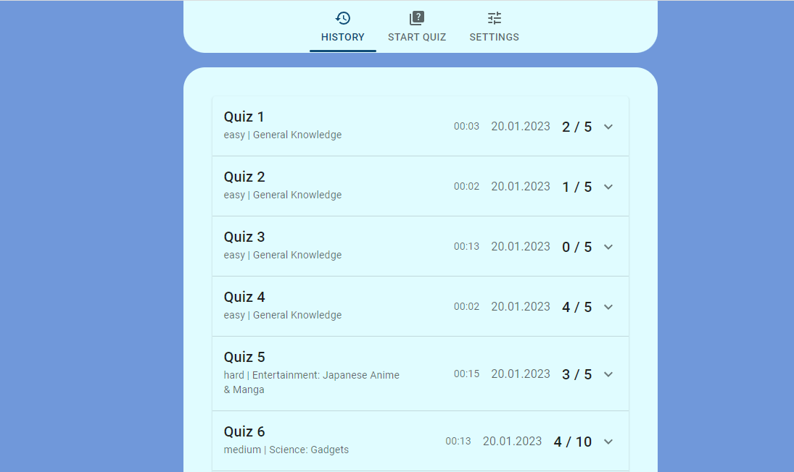
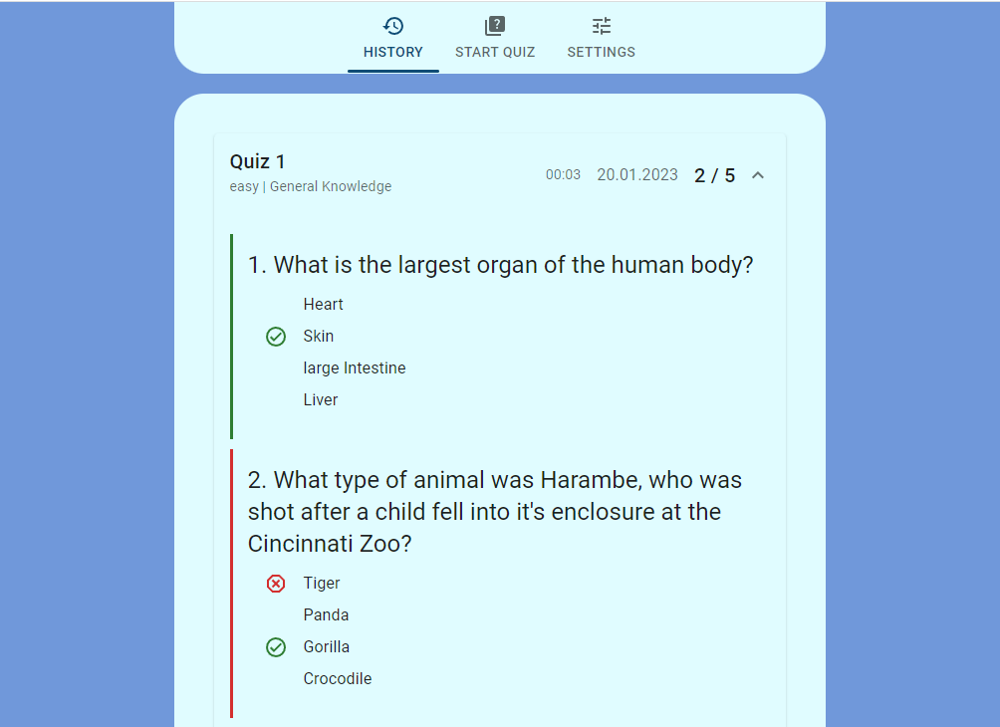
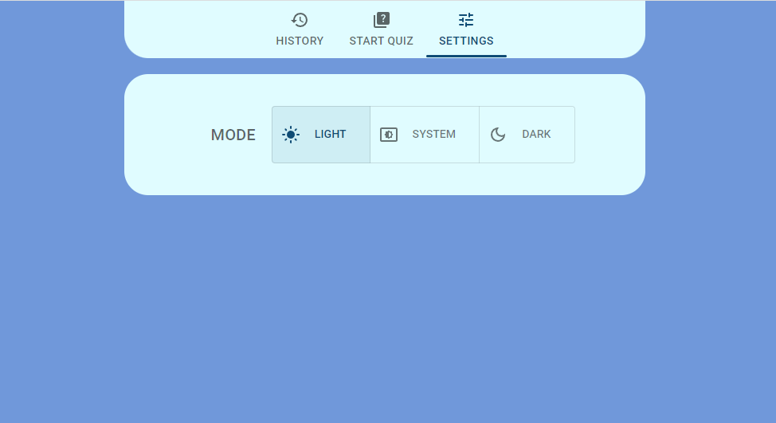
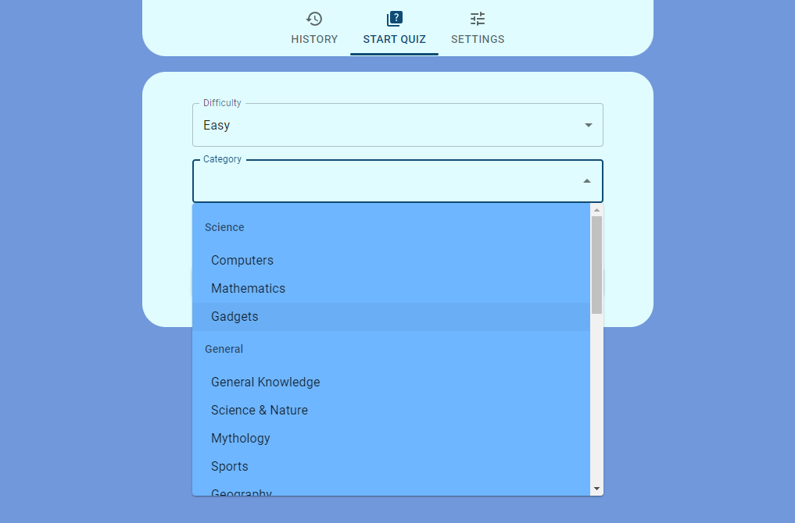
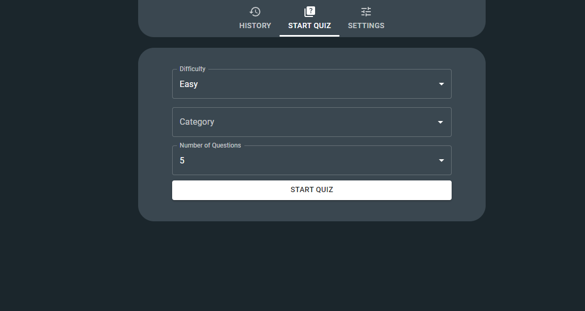
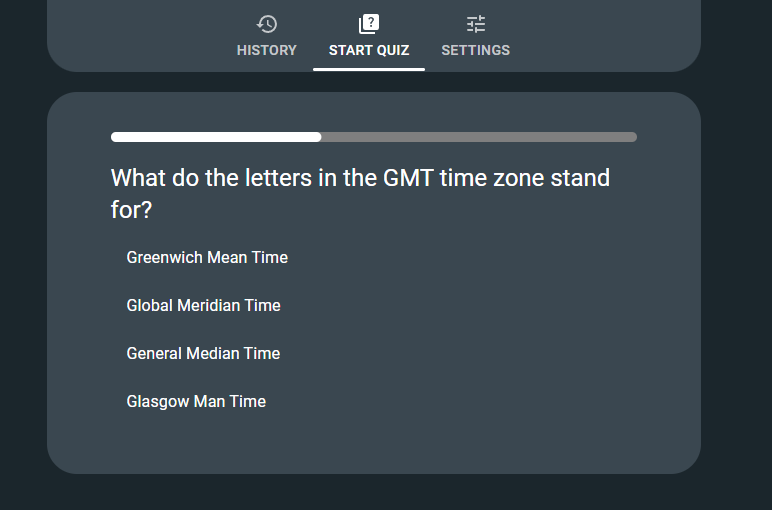
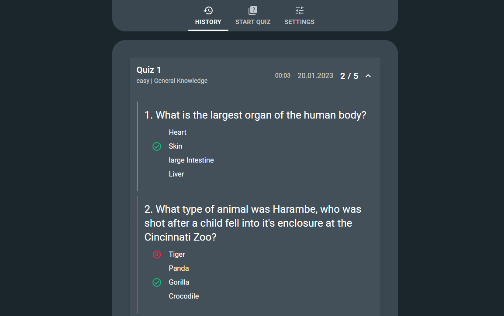

# Quiz

This React JS application offers a streamlined and efficient way to take and practice tests on a wide range of topics. 
With the ability to view your test history, you can track your progress and identify areas where you need improvement. 
The application also includes a dark and light mode, allowing you to customize your test-taking experience to your preference. 
Additionally, you can select the number of questions and the specific topic of the test, making it easy to focus on the areas you need to improve the most. 
Whether you're preparing for a certification exam or just looking to brush up on your knowledge, this application is the perfect tool to help you achieve your goals.  

### <a href="" target="_blank">Play Quiz</a>

---
## Technologies  
- React JS  
- Material UI
- The Open Trivia Database for questions <a href="https://opentdb.com" target="_blank">Trivia DB</a>
---

## Main screen

## History

## History: View questions

## Settings

## Select Category

---
# Dark Mode

## Start Quiz

## Quiz

## History

